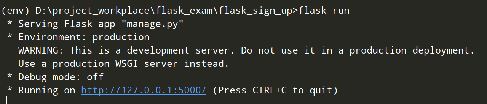
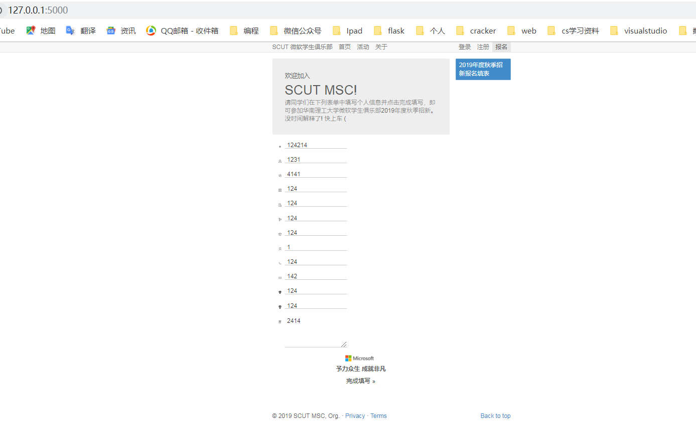
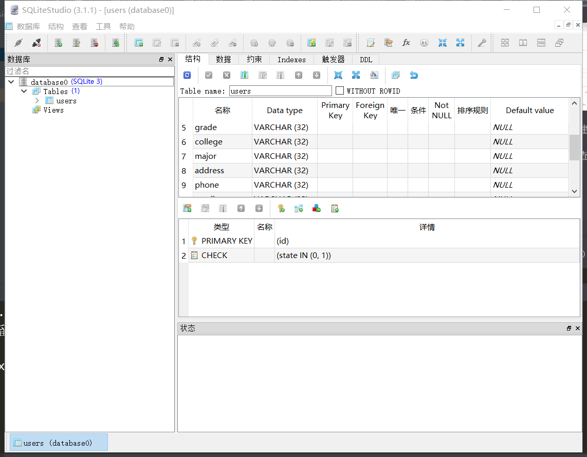
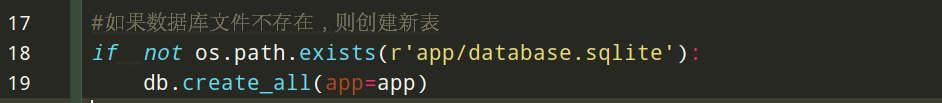
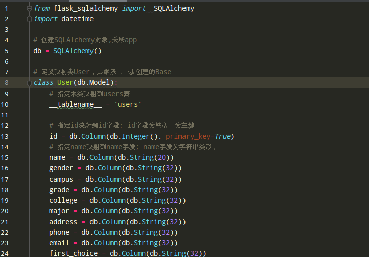
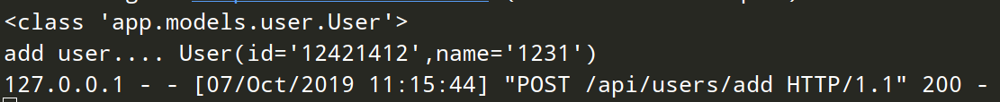
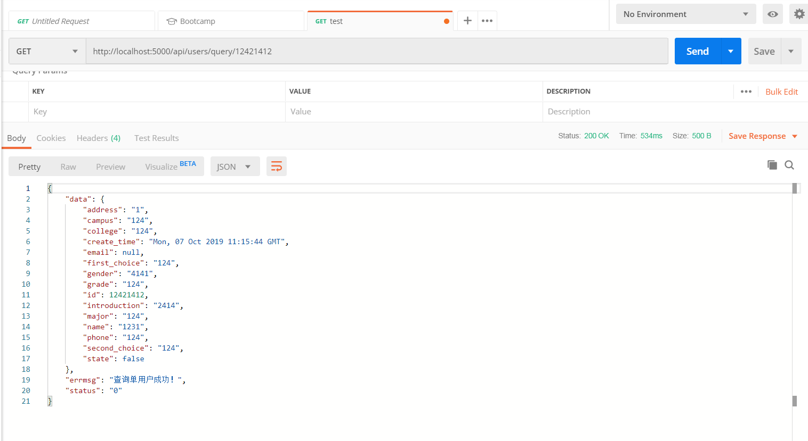
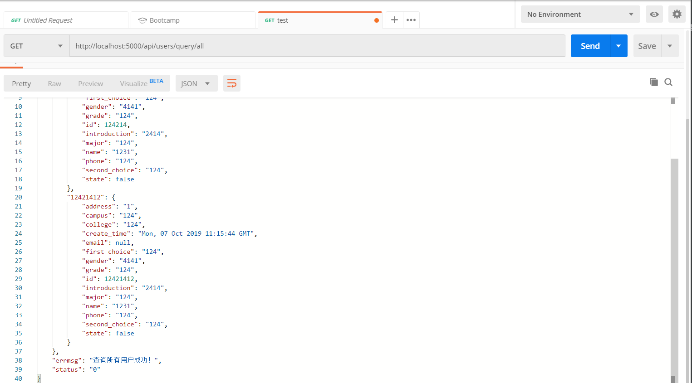
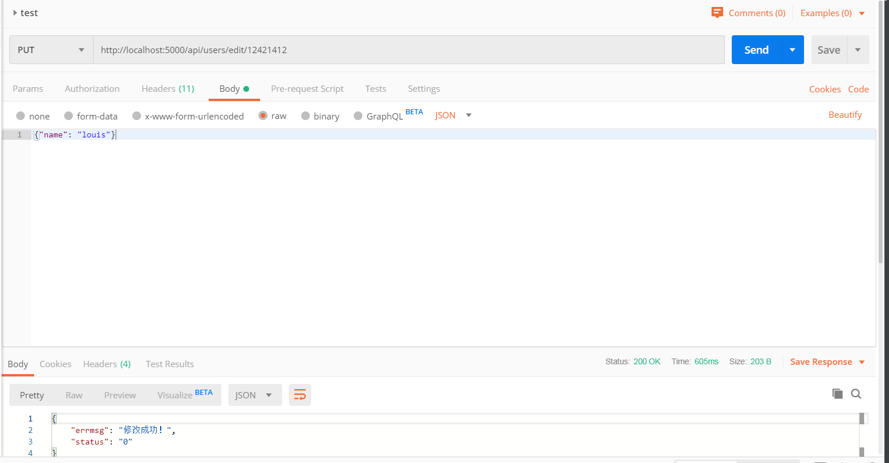
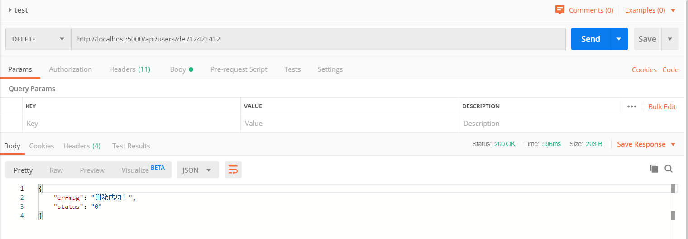

# 华南理工大学微软学生俱乐部2019年度秋季招新报名链接🔗

## 目录结构  

    ├─Recruit2019_Flask
    │  ├─app
    │  │  ├─database.sqlite                 //数据库文件
    │  │  ├─config.py                   //数据库配置、启动参数配置
    │  │  ├─log                 //日志记录
    │  │  ├─models                       // 数据库关系模式
    │  │  │   ├─user.py                   //用户模型
    │  │  ├─utility             //公用工具
    │  │  │    ├─log_tool             //日志记录工具
    │  │  ├─templates            //网页模板
    │  │      └─index.html               // 布局
    │  │  └─routes                  // 路由、数据库操作接口
    │  │  │    ├─ myapi.py              //接口路由
    │  │  │    ├─ frontend.py           //前台路由
    │  │  ├─static                      //静态文件
    │  │       ├─css                    // 样式
    │  │       ├─img                    // 素材
    │  │       ├─js
    │  │       │  ├─controllers // 前后端控制器
    │  │       │  └─services // 后端服务发送
    │  ├─requirements.txt //依赖包清单
    │  ├─manage.py //启动程序
    │  ├─README.md //帮助文档

## 本地测试  

### 前置环境 [local]  

- Sqlite3
- Flask

### 启动步骤 [local]

## Run  Recruit2019_Flask  with a SQLite database

### (Optional) Set up a [virtual environment](https://docs.python.org/3/library/venv.html)

### 1. Get the code
    git clone https://github.com/liuyixin-louis/Recruit2019_Flask.git
    cd Recruit2019_Flask

### 2. Install requirements
    pip install -r requirements.txt

### 3. Set the FLASK_APP environment variable
    (Windows) set FLASK_APP=manage.py
    (Unix) export FLASK_APP=manage.py
    (Powershell) $env:FLASK_APP = ".\manage.py"

### 4. Run the application
    flask run --port=3000

### 4. Go to http://localhost:3000/

##程序运行截图

- 1.程序启动：
    
    
- 2.连接数据库并创建数据表：
    
    
    
    
- 3.对数据库的增删查改及后端接口：

    增：
    
    
    查：
    
    
    改：
    
    删：
    

## Todo
- [ ] 前端（表单验证）
- [ ] 数据库迁移
- [ ] 云部署

